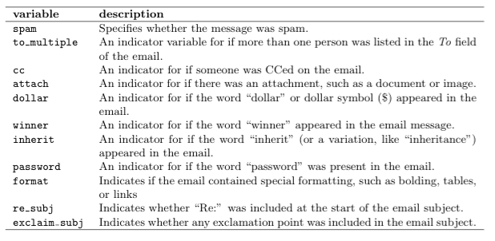

```{r  message=FALSE, warning=FALSE}
library(plyr, quietly = T, warn.conflicts = F)
library(ggplot2, quietly = T, warn.conflicts = F)
library(dplyr, quietly = T, warn.conflicts = F)
library("GGally", quietly = T, warn.conflicts = F)
library("gmodels", quietly = T, warn.conflicts = F)
library("kernlab", quietly = T, warn.conflicts = F)
library(caret, quietly = T, warn.conflicts = F)
require("grid")
require("C50")
```


#Introdução
__Universidade Federal de Campina Grande - DSC  __  
__Disciplina: Inteligência Artificial  __  
__Professor: Herman Martins Gomes  __  
__Grupo:__ Arthur Sena/Bruna Amorim/Leonardo Alves  

##Objetivo
O nosso projeto tem como objetivo comparar três modelos de "Machine learning" a respeito da performance deles quanto a predição de e-mails como spam ou não spam. Usaremos as métricas Recall, Precision e F-measure a fim de comparar seus desempenhos. Os modelos escolhidos para nosso experimento estão descritos logo abaixo.

__Árvores de Decisão__  
__KNN Model__  
__SVM__  

##Principais Ferramentas
[R version 3.2.1](http://www.r-project.org/) - Ferramenta para análise estatística.   
[Openintro Package](http://cran.r-project.org/web/packages/openintro/openintro.pdf#Rfn.email50) - Pacote, onde foram obtidos os emails.  
[Caret Package](http://caret.r-forge.r-project.org/) - Pacote usado para treinar e testar os nossos modelos.  

Obs.: Será utilizado alguns pacotes adicionais para facilitar a manipulação e visualiazação dos dados.

##Dados
Vamos utilizar um conjunto de dados que representam informações sobre uma coleção de e-mails classificados como spam ou não spam. Tais dados foram obtidos a partir do pacote "openintro". Cada email do conjunto apresenta o seguinte conjunto de variáveis:



Uma pequena amostra dos nossos dados jutamante com algumas variáveis pode ser visualizada logo abaixo:

```{r  message=FALSE, warning=FALSE}
  emails <- read.csv("Data/emails.csv")
  head(emails[,c(1,3,4,5,7,8,13,14,15)])
```

##Análise dos dados
Antes de fazer qualquer tipo de construção de modelo devemos analisar nossos dados e verificar quais variáveis apresentam uma correlação mais forte com a variável spam. Utilizaremos a correlação linear a fim de fazer tal checagem. Lembrando que quanto mais perto de zero mais fraca é a correlação entre as variáveis. Caso o valor seja próximo de -1, então temos uma correlação negativa e quanto mais próximo de 1 uma correlação positiva. 

```{r  message=FALSE, warning=FALSE}
#Fazendo alguns ajustes nos nossos dados.
emails[,"time"] <- as.character(emails[,"time"]) 
emails[,"time"] <- as.numeric(as.POSIXct(emails[,"time"]))
levels(emails[,"number"]) <- c(1,0,-1)
emails[,"number"] <- as.numeric(emails[,"number"])
emails[,"winner"] <- as.numeric(emails[,"winner"]) 

df <- as.data.frame(cor(emails)[,1])
df <- cbind(Variaveis = rownames(df), df)
rownames(df) <- NULL
colnames(df) <- c("Variaveis","Correlacao")
df <- df[-1,]
ggplot(df, aes(x = Variaveis, y = Correlacao),width = 5) + geom_bar(stat="identity") + theme(axis.text.x = element_text(angle=45, vjust=1))
```

O gráfico de barras acima mostra a correlação de nossas variáveis com a variável spam. Notamos que algumas variáveis se sobressaem sobre outras. Tais variáveis são:

* Format  
* To_Multiple   
* Line_breaks   
* Number  
* Num_char  
* Re_subj  
* Sent_email   

Desse modo, usaremos como base tais variáveis para construir nossos modelos de predição.

##Criando e treinando nossos modelos - Primeiros Modelos
Nessa parte do relatório, vamos usar uma biblioteca do R conhecida como "Caret". Tal biblioteca apresenta um grande quantidade de algoritmos de classificação implementados. Assim sendo, vamos usar a técnica de crossvalidation para criar nossos modelos, pois queremos evitar o 'overfitting'. Antes de iniciar o treinamento dos modelos vamos dividir os emails em um conjunto de treinamento e de testes.

```{r warning=FALSE, message=FALSE}
spam <- filter(emails, spam == 1)
nao_spam <- filter(emails, spam == 0) 

#Criando conjunto de treino. 75% 
treino <- rbind(spam,nao_spam[1:2573,])
#Criando conjunto de testes. 25%
teste<- rbind(spam,nao_spam[2574:3554,])
```

Dividimos nosso conjunto de forma que 75% dos dados se tornaram nosso treino e os 25% restantes nossos testes. Agora podemos iniciar o treinamento dos nossos modelos.

```{r  message=FALSE, warning=FALSE}
treino[,"spam"]<- as.factor(treino$spam)
#Usando o KNN
control = trainControl(method = "repeatedcv", number=10,repeats = 10)
knn_grid = expand.grid(k=c(1:20))
knn_model = train(spam~num_char+sent_email+to_multiple+format+line_breaks+number+re_subj,  data=treino ,method="knn",preProcess=c("range"),tuneGrid = knn_grid,trControl=control, na.action=na.omit)

#Usando o SVM
control <- trainControl(method="repeatedcv", number=10,repeats=10)
modelSvm <- train(spam~num_char+sent_email+to_multiple+format+line_breaks+number+re_subj, data=treino, method="svmRadial", trControl=control)

#Usando C50
control <- trainControl(method="repeatedcv", number=10, repeats=10)
modelC50<- train(spam~num_char+sent_email+to_multiple+format+line_breaks+number+re_subj, data=treino, method="C5.0", trControl=control)
```

#Primeira Predição
Com os modelos criados podemos fazer nossa primeira predição em cima dos dados de teste e, logo após, verificar o desempenho dos classifcadores.

```{r  message=FALSE, warning=FALSE}
teste[,"spam"]<- as.factor(teste$spam)
#KNN
pred_knn<-predict(knn_model, newdata = as.data.frame(teste),na.action=na.omit)
CrossTable(teste$spam, pred_knn, prop.chisq = FALSE, prop.c = FALSE, prop.r = FALSE, dnn = c('actual', 'predicted'))
 precision  <- 362/428
 recall <- 362/367
 Fmeasure_knn <-  2 * precision * recall / (precision + recall)

#SVM
pred_svm<-predict(modelSvm, newdata = teste)
CrossTable(teste$spam, pred_svm, prop.chisq = FALSE, prop.c = FALSE, prop.r = FALSE, dnn = c('actual', 'predicted'))
 precision  <- 62/71
 recall <- 62/367
 Fmeasure_svm <-  2 * precision * recall / (precision + recall)

#C50
pred_c50<-predict(modelC50, newdata = teste)
CrossTable(teste$spam, pred_c50, prop.chisq = FALSE, prop.c = FALSE, prop.r = FALSE, dnn = c('actual', 'predicted'))
 precision  <- 225/272
 recall <- 225/367
 Fmeasure_c50 <-  2 * precision * recall / (precision + recall)

Modelos = c("ÁrvoreDec", "KNN", "SVM") 
Fmeasures = c(Fmeasure_c50,Fmeasure_knn,Fmeasure_svm)
df = data.frame(Modelos, Fmeasures)  
ggplot(df, aes(x = Modelos, y = Fmeasures)) + geom_bar(stat="identity")
```
